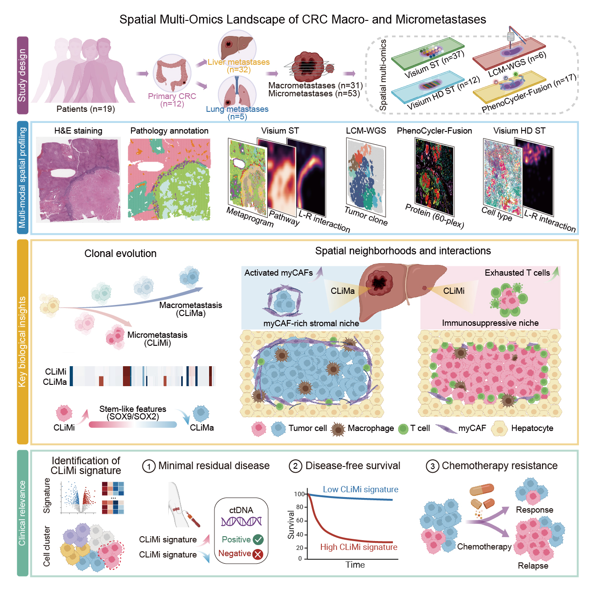

# CRC_micromets_ST
## Spatial Multi-Omics Landscape of Colorectal Cancer Macro- and Micrometastases 
Colorectal cancer (CRC) metastases frequently recur due to minimal residual disease and persistent micrometastases after therapy. Here, we performed spatial multimodal profiling using spot-level and high-resolution spatial transcriptomics, multi-regional whole-genome sequencing following laser-capture microdissection, and high-plex protein imaging to map 49 tumors from 19 patients, encompassing paired primary CRC and matched liver (CLiM) and lung (CLuM) metastases. Phylogenetic reconstruction revealed that liver micrometastases (CLiMi) arise from early clonal divergences and retain a stem-like, quiescent state consistent with metastatic dormancy. Spatially, we uncovered distinct stromal barriers: macrometastases were encapsulated by myofibroblasts, whereas micrometastases were surrounded by immunosuppressive niches characterized by T-cell exhaustion and distinct ligand-receptor signaling networks. Notably, we identified a CLiMi-specific six-gene signature associated with MRD status, disease-free survival, and chemotherapy resistance across multiple independent cohorts. These findings elucidate the spatial evolutionary landscape of CRC metastases and provide tissue-based spatially validated biomarkers for surveillance and therapeutic targeting. 
## Graphical Abstract

## Software Availability
Software Versions

The following software and tools were used in this study:

**R Packages**

Seurat v5.2.1, BayesSpace v1.10.1, CytoTRACE v0.3.3, ggraph v2.2.1, survminer v0.5.0, survival v3.7.0, survcomp v1.54.0, GSVA v1.52.3, NMF v0.27, SpatialInferCNV v1.0.1, CellChat v2.1.2, CNVkit v0.9.12

**Python Packages**

cell2location v0.1.4, Stardist v0.8.3, Cellpose v4.0.4, SMURF v1.0.2
## Data Availability
Meta_data
The Meta_data directory contains pathological annotations for: Visium and Visium HD spatial transcriptomics samples
These annotations include region labels, pathological classifications, and associated metadata used for downstream spatial analyses.
## Visualization and Intermediate Data
All additional data used for figure generation, including processed matrices and intermediate outputs, have been deposited on Zenodo.
Zenodo repository: 👉 [https://zenodo.org/records/17796737]
## Notes
For any questions, please leave your comment in GitHub or contact Yang Liu (yliu47@mdanderson.org). We will help address the issues as soon as possible.
